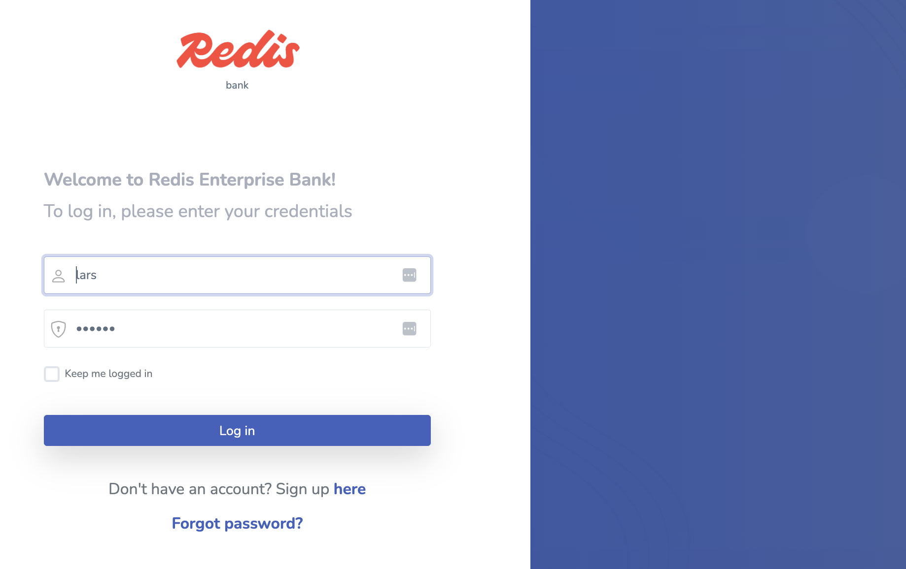
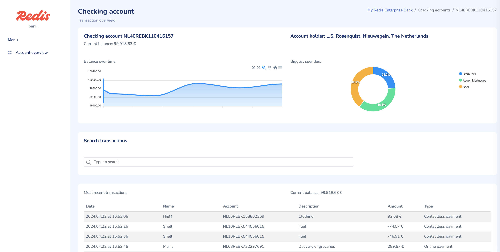

# About this repository

This repository uses Redis core data structures, Streams, RediSearch and TimeSeries to build a
Java/Spring Boot/Spring Data Redis Reactive application that shows a searchable transaction overview with realtime updates
as well as a personal finance management overview with realtime balance and biggest spenders updates. UI in Bootstrap/CSS/Vue.

Features in this demo:

- Redis Streams for the realtime transactions
- Redis TimeSeries for the balance over time
- RediSearch for searching transactions
- Sorted Sets for the 'biggest spenders'
- Redis hashes for session storage (via Spring Session)

## Architecture


## Prerequisites

1. JDK 17 or higher (<https://openjdk.java.net/install/index.html>). Not needed if you're using Docker.
1. Maven. Not needed if you're using Docker.
1. Docker Desktop (<https://www.docker.com/products/docker-desktop>), or Colima with a docker/k8s/containerd runtime
1. For running on Azure only: Azure CLI (<https://docs.microsoft.com/en-us/cli/azure/install-azure-cli>)
1. For running on Azure only: Azure Spring Cloud extension for the Azure CLI (<https://docs.microsoft.com/en-us/cli/azure/spring-cloud?view=azure-cli-latest>)
1. For running on Kubernetes: a Kubernetes cluster

## Running locally

1. Git clone this repository
2. `docker compose build` will produce a local maven build and local docker image with the application
3. `docker compose up` will start Redis and the application
4. Navigate to <http://localhost:8080>
5. Login with user `lars` (the password `larsje` is already configured for you)
6. Download/use [Redis Insight](https://redis.io/insight/) to explore the content of the Redis database (the Redis on docker is exposed on localhost:6379) 
7. Stop and clean with `docker compose down -v --rmi local --remove-orphans`

## Application overview






## Running on Azure Spring Cloud

1. Follow the steps from 'Running locally'
1. Make sure you are logged into the Azure CLI
1. Add the Azure Spring Cloud extension to the Azure CLI `az extension add --name spring-cloud` If you already have the extension, make sure it's up to date using `az extension update --name spring-cloud`
1. Create an Azure Spring Cloud instance using `az spring-cloud create -n acrebank -g rdsLroACRE -l northeurope` (this may take a few minutes)
1. Create an App in the newly created Azure Spring Cloud instance using `az spring-cloud app create -n acrebankapp -s acrebank -g rdsLroACRE --assign-endpoint true --runtime-version Java_11`
1. Modify the application.properties so it points to your newly created ACRE instance

    ```sh
    spring.redis.host=your ACRE hostname
    spring.redis.port=your ACRE port (default: 10000)
    spring.redis.password= your ACRE access key
    ```

1. Modify the application.properties so the websocket config will point to the Azure Spring Cloud app instance endpoint createed in step 3.

    ```sh
    stomp.host=your ASC app endpoint URL (Default: <appname>-<service-name>.azuremicroservices.io)
    stomp.port=443
    stomp.protocol=wss
    ```

1. Rebuild the app using `./mvnw package`
1. Deploy the app to Azure Spring Cloud using `az spring-cloud app deploy -n acrebankapp -s acrebank -g rdsLroAcre --jar-path target/redisbank-0.0.1-SNAPSHOT.jar`

### Troubleshooting tips on Azure Spring Cloud

To get the application logs:

`az spring-cloud app logs -n acrebankapp -g rdsLroAcre -s acrebank`

Note: project is compiled with JDK11 as that's currently the max LTS version that's supported by Azure Spring Cloud. Project will run fine when running locally or on other platforms up to JDK16.

## Running on OpenShift via S2I

Please see [OpenShift via S2I](./openshift/README.md).

## Running on Kubernetes as a Deployment with Redis OSS

Please see [Deploy on Kubernetes with Redis OSS](./kubernetes/redis-oss.md)

## Running on Kubernetes as a Deployment with Redis Enterprise

Please see [Deploy on Kubernetes with Redis Enterprise](./kubernetes/redis-enterprise.md)

## V.next

1. Thread safety. Data is currently generated off of a single stream of transactions, which means it's the same for all users. Not a problem with the current iteration because it's single user, but beware when expanding this to multi-user.
1. Hardcoded values. Code uses hardcoded values throughout the code, these need to be replaced with proper variables.
