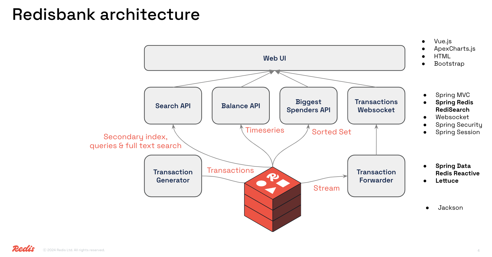

# About this repository

This repository uses Redis core data structures, Streams, RediSearch and TimeSeries to build a
Java/Spring Boot/Spring Data Redis Reactive application that shows a searchable transaction overview with realtime updates
as well as a personal finance management overview with realtime balance and biggest spenders updates. UI in Bootstrap/CSS/Vue.

Features in this demo:

- Redis Streams for the realtime transactions
- Redis TimeSeries for the balance over time
- RediSearch for searching transactions
- Sorted Sets for the 'biggest spenders'
- Redis hashes for session storage (via Spring Session)

# Architecture


# Getting Started

## Prerequisites

1. JDK 11 or higher (https://openjdk.java.net/install/index.html)
2. Docker Desktop (https://www.docker.com/products/docker-desktop)
3. Azure CLI (https://docs.microsoft.com/en-us/cli/azure/install-azure-cli)
4. Azure Spring Cloud extension for the Azure CLI (https://docs.microsoft.com/en-us/cli/azure/spring-cloud?view=azure-cli-latest)

## Running locally

1. Checkout the project
2. `docker run -p 6379:6379 redislabs/redismod:latest`
3. `./mvnw clean package spring-boot:run`
4. Navigate to http://localhost:8080 and login with user lars and password larsje

## Running on Azure Spring Cloud

1. Follow the steps from 'Running locally'
2. Make sure you are logged into the Azure CLI
3. Add the Azure Spring Cloud extension to the Azure CLI `az extension add --name spring-cloud` If you already have the extension, make sure it's up to date using `az extension update --name spring-cloud`
2. Create an Azure Spring Cloud instance using `az spring-cloud create -n acrebank -g rdsLroACRE -l northeurope` (this may take a few minutes)
3. Create an App in the newly created Azure Spring Cloud instance using `az spring-cloud app create -n acrebankapp -s acrebank -g rdsLroACRE --assign-endpoint true --runtime-version Java_11`
4. Modify the application.properties so it points to your newly created ACRE instance

```
spring.redis.host=your ACRE hostname
spring.redis.port=your ACRE port (default: 10000)
spring.redis.password= your ACRE access key
```

5. Modify the application.properties so the websocket config will point to the Azure Spring Cloud app instance endpoint createed in step 3.

```
stomp.host=your ASC app endpoint URL (Default: <appname>-<service-name>.azuremicroservices.io)
stomp.port=443
stomp.protocol=wss
```

6. Rebuild the app using `./mvnw package`
7. Deploy the app to Azure Spring Cloud using `az spring-cloud app deploy -n acrebankapp -s acrebank -g rdsLroAcre --jar-path target/redisbank-0.0.1-SNAPSHOT.jar`

## Troubleshooting tips on Azure Spring Cloud

To get the application logs:

`az spring-cloud app logs -n acrebankapp -g rdsLroAcre -s acrebank`

Note: project is compiled with JDK11 as that's currently the max LTS version that's supported by Azure Spring Cloud. Project will run fine when running locally or on other platforms up to JDK16.

## Known issues

1. Thread safety. Data is currently generated off of a single stream of transactions, which means it's the same for all users. Not a problem with the current iteration because it's single user, but beware when expanding this to multi-user.
2. Hardcoded values. Code uses hardcoded values throughout the code, these need to be replaced with proper variables.